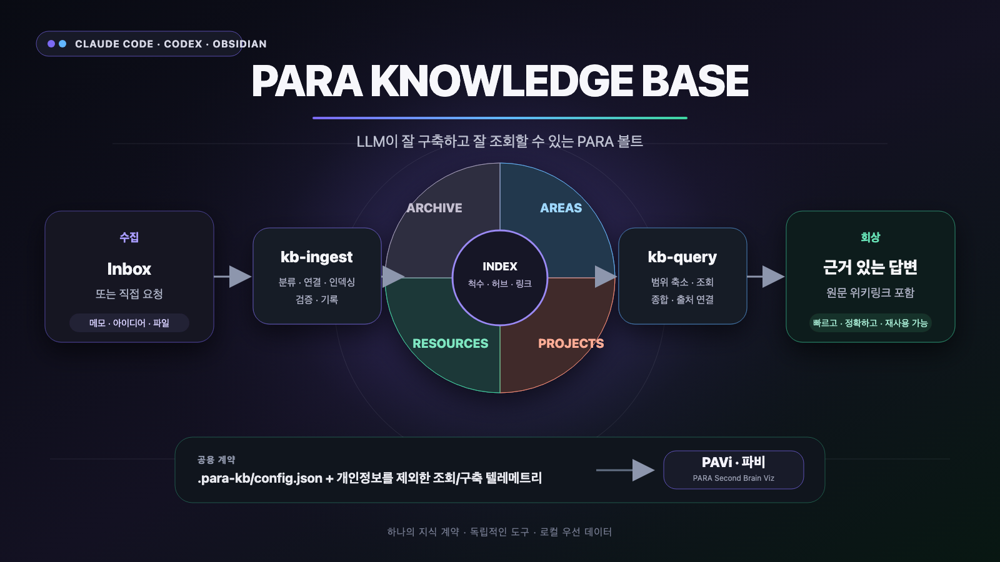

# PARA Knowledge Base — Claude Code + Codex 플러그인

[English](README.md) | [한국어](README.ko.md)



> **LLM as Knowledge Compiler** — Karpathy의 LLM Knowledge Base 패턴을 PARA Obsidian vault에 맞게 적용합니다.

PARA Knowledge Base는 Claude Code와 Codex가 매번 vault 전체를 다시 훑지 않도록, 기존 PARA 구조 위에 작고 지속적인 지식 운영 계층을 만듭니다. 새 자료를 알맞은 위치에 구축하고, 저렴한 인덱스부터 조회하고, 링크와 구조 건강을 점검하며, 필요할 때만 개인정보를 제외한 운영 텔레메트리를 남깁니다.

## 왜 필요한가

일반적인 에이전트는 질문마다 폴더 구조를 다시 파악하고 많은 문서를 읽습니다. 이 플러그인은 다음 흐름을 표준화합니다.

```text
Inbox 또는 직접 요청
  → kb-ingest: 분류 · 요약 · 연결 · 인덱싱 · 검증
  → Projects / Areas / Resources / Archive
  → kb-query: 인덱스 · 태그 · 백링크부터 좁혀 조회
  → 원문 링크가 포함된 답변
```

핵심은 Markdown, frontmatter, wikilink, `_index.md`를 그대로 사용하는 것입니다. 전용 데이터베이스에 지식을 가두지 않으므로 사람은 Obsidian에서 읽고 고칠 수 있고, Claude Code와 Codex는 같은 구조를 저렴하게 탐색할 수 있습니다.

## PARA 운영 방식

- **Projects** — 기한과 산출물이 있는 활성 작업. 프로젝트 고유 기록과 선택적 프로젝트 허브를 둡니다.
- **Areas** — 종료 시점이 없는 책임과 장기 관리 주제입니다.
- **Resources** — 프로젝트가 끝나도 재사용할 수 있는 참고 지식입니다.
- **Archive** — 완료·중단된 프로젝트의 고유 기록을 보관하는 저활성 영역입니다.
- **Inbox** — 선택적인 임시 수집함입니다. 사용자가 직접 “위키에 만들어줘”라고 요청하면 Inbox를 거치지 않고 최종 위치에 바로 구축할 수도 있습니다.

프로젝트가 끝날 때는 폴더를 통째로 버리지 않습니다. 재사용 지식은 Resources로, 지속 책임은 Areas로 환류하고, 프로젝트에만 해당하는 기록만 Archive로 보냅니다. 최상위 인덱스와 카테고리 인덱스, 필요한 프로젝트 허브가 이 흐름의 진입점이 됩니다.

## 제공 스킬

| 스킬 | 역할 |
|---|---|
| `kb-init` | 새 vault를 초기화하거나 기존 PARA vault를 감지해 공용 설정을 설치합니다. |
| `kb-ingest` | Inbox·지정 경로·직접 생성 요청을 분류하고, 문서를 생성/이동하고, 요약·링크·인덱스·로그를 갱신합니다. |
| `kb-query` | 질문에 맞는 가장 싼 경로부터 후보를 좁히고 필요한 원문만 읽어 출처 링크와 함께 답합니다. |
| `kb-index` | 변경된 구조와 문서만 감지해 최상위/카테고리/프로젝트 허브를 갱신합니다. |
| `kb-lint` | broken link, orphan, index drift, tag/frontmatter 문제와 오래된 콘텐츠를 점검합니다. |

## 선택적 텔레메트리

`.para-kb/config.json`에서 활성화하면 `kb-query`와 `kb-ingest`의 의미 작업 단위를 JSONL로 기록할 수 있습니다.

- 하나의 query/build는 정확히 하나의 `operation_id`로 시작·step·summary·complete 이벤트를 묶습니다.
- 실제 사용한 route, entrypoint, 문서 경로, 배치·링크·검증 결과와 런타임이 제공하는 시간·도구·토큰 수치만 기록합니다.
- 질문, 답변, 문서 본문, 발췌, 비밀값, 절대경로는 저장하지 않습니다.
- 작업별 토큰을 분리할 수 없으면 세션 전체 값을 억지로 복사하지 않고 N/A로 둡니다.
- 이 파일은 지식 문서가 아니므로 인덱스에 넣거나 일반 조회 중 읽지 않습니다.

정확한 이벤트와 설정 규격은 [상호운용 계약](contracts/README.md)과 [합성 예제](examples/telemetry/)에서 확인할 수 있습니다.

## PARA Second Brain Viz 연계

[PARA Second Brain Viz](https://github.com/ernestolee13/para-second-brain-viz), 애칭 **PAVi(파비, PARA Analytics & Visualization)**는 이미 구축된 PARA 구조와 이 플러그인이 남긴 선택적 텔레메트리를 읽어 시각화·분석하는 독립 Obsidian 플러그인입니다. 지식을 만들거나 조회하는 도구가 아니라, 구조와 사용 흔적을 관찰하고 개선 지점을 찾는 읽기 전용 도구입니다.

[](https://github.com/ernestolee13/para-second-brain-viz)

*검색 리플레이는 개인정보 비포함 조회 로그를 동시 그래프 경로, PARA 영역 도달 범위와 선택 가능한 실행별 통계로 바꿔 보여줍니다.*

- **PARA Knowledge Base:** 지식을 구축·조회·인덱싱·점검하고 운영 기록을 생산합니다.
- **PARA Second Brain Viz:** 구조, 활동과 성장, 검색 리플레이, 구축 리플레이, orphan·비활성 영역과 비용 지표를 하나의 그래프에서 보여줍니다.
- **함께 사용할 때:** `.para-kb/config.json`을 자동 감지하므로 PARA 루트, 인덱스, 척수 문서, 제외 경로와 로그 위치를 중복 설정하지 않아도 됩니다.
- **따로 사용할 때:** 이 플러그인은 시각화 없이 완전하게 동작하고, 시각화 플러그인도 내장/사용자 정의 프로필로 독립 실행됩니다.

두 저장소는 서로의 런타임 코드를 포함하지 않습니다. vault 안의 버전형 설정과 개인정보 비포함 JSONL만 공유하므로 느슨하게 연계되고 독립적으로 배포할 수 있습니다.

## 설치

### Claude Code

```bash
/plugin marketplace add ernestolee13/para-knowledge-base
/plugin install para-knowledge-base@para-knowledge-base
```

설치 후 플러그인을 다시 로드하고 Obsidian vault에서 `kb-init`을 실행합니다.

### Codex

이 저장소의 Codex 플러그인/스킬을 설치한 뒤 vault 루트에서 `kb-init`을 실행합니다. 초기화는 번호형 PARA, 표준 PARA, 사용자 정의 구조를 감지하고 `.para-kb/config.json`, 공용 규칙과 필요한 인덱스를 생성하거나 채택합니다.

```text
kb-init
kb-lint
```

기존 vault의 문서와 폴더를 삭제하지 않으며, 구조 변경이 필요한 경우 먼저 감지 결과와 대상 범위를 확인합니다.

## 일상 사용

```text
kb-ingest                      # Inbox 처리 또는 새 위키 문서 구축
kb-query "이번 주 프로젝트 위험은?"  # 근거 문서와 함께 조회
kb-lint                        # 주간 건강 점검
kb-index                       # 큰 이동/정리 후 인덱스 갱신
```

더 구체적인 자동화, 라우팅, Inbox 채널, 텔레메트리와 문제 해결은 [한국어 운영 가이드](USAGE.ko.md)를 참고하세요. 영어 운영 가이드는 [USAGE.md](USAGE.md)에 있습니다.

## 개발과 검증

저장소의 스킬과 emitter는 개인 vault 이름이나 절대경로를 전제로 하지 않습니다. 테스트 fixture도 합성 데이터만 사용합니다.

```bash
python3 -m unittest discover -s tests -p 'test_*.py'
python3 scripts/validate_plugin.py
python3 scripts/validate_marketplace.py
```

MIT License로 배포됩니다.
