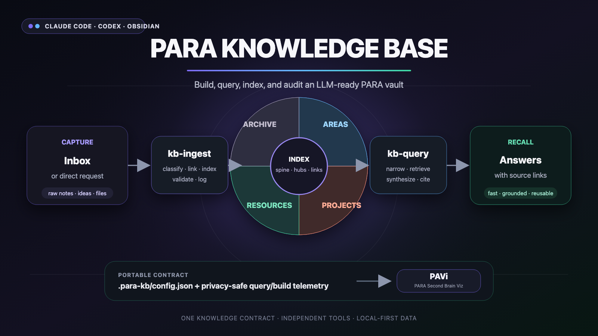
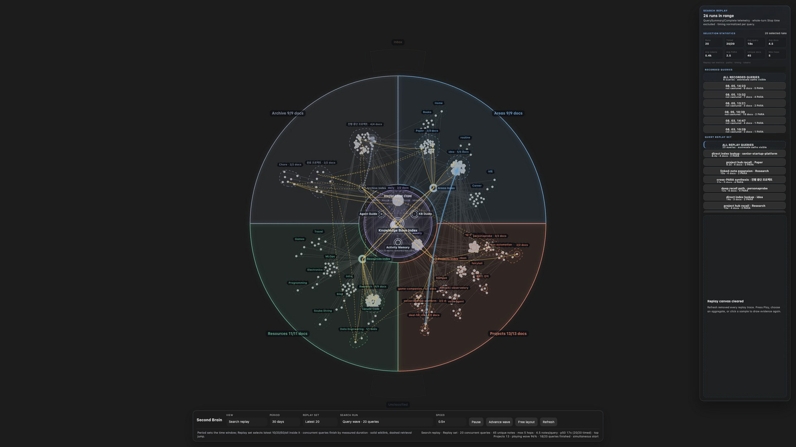

# PARA Knowledge Base — Claude Code + Codex Plugin

[English](README.md) | [한국어](README.ko.md)



> **LLM as Knowledge Compiler** — Karpathy's LLM Knowledge Base pattern, optimized for PARA Obsidian vaults

---

## Inspiration

Inspired by [Karpathy's llm-wiki](https://gist.github.com/karpathy/442a6bf555914893e9891c11519de94f) — the idea that an LLM should act as a **knowledge compiler**, not a search engine. Rather than re-retrieving and re-summarizing raw notes on every query, knowledge is compiled once into structured wiki-style articles, then maintained incrementally as new information arrives.

This plugin applies that pattern to PARA-structured Obsidian vaults.

See [examples/](./examples/) for a fictional initialized vault snapshot, including indexes, a project hub, a change log, and optional query telemetry.

---

## Why this plugin?

If you already have a PARA vault with hundreds of notes, Claude Code or Codex can read them — but **every conversation starts from scratch**. Each query re-reads files, re-discovers structure, and burns tokens figuring out what's where.

This plugin fixes that by adding a **persistent knowledge layer** on top of your existing vault:

**The problem without a KB:**
```
User: "What do I know about distributed systems?"
Claude: reads 30+ files → 15K tokens → synthesizes answer → forgotten next session
User: (asks again next week)
Claude: reads the same 30+ files again → 15K tokens again
```

**With this plugin:**
```
/kb-ingest              → new notes classified, linked, indexed (once)
/kb-query "distributed systems"  → reads _index.md (50 tokens) → targets 2 files (400 tokens) → done
```

### What you get on top of your existing PARA vault

| Already have | This plugin adds |
|---|---|
| Folders organized by PARA | `_index.md` per category — Claude reads 10 lines instead of scanning 100 files |
| Notes with some tags | Tag convention detection + consistency enforcement across vault |
| Manual wikilinks | Auto-generated wikilinks on ingest — first occurrence of known terms linked automatically |
| CLAUDE.md with basic rules | Full vault schema — structure, KB operations, tag system, navigation strategies |
| Raw notes in Inbox | One-command classification + move + metadata + linking |
| Unmeasured ad-hoc searches and builds | Optional operation telemetry — route, document/link counts, tool/time/token signals for later analysis |

### Token efficiency

| Operation | Without plugin | With plugin |
|---|---|---|
| "What projects am I working on?" | Scan all project folders ~3K tokens | Read `_index.md` ~50 tokens |
| "Find everything about topic X" | Grep entire vault ~5K tokens | Tag search via index ~200 tokens |
| Ingest a new document | Manual: move, tag, link, update index | `/kb-ingest` — all automated, ~500 tokens |
| Weekly health check | Not possible | `/kb-lint` — orphans, broken links, stale content |

The key insight: **indexes are cheap to read, and they tell Claude exactly where to look.** Instead of scanning your whole vault every time, Claude reads a 10-line index, picks the right folder, and reads only what's needed.

---

## Concept

### The 3-Layer Architecture

```
Inbox/          ← raw capture (fleeting notes, clippings, meeting notes)
PARA/           ← compiled knowledge wiki (Projects / Areas / Resources / Archives)
CLAUDE.md       ← vault schema (topics, conventions, wikilink vocabulary)
```

- **Inbox** is the staging area. Raw, unprocessed, low-friction.
- **PARA** is the knowledge base. LLM-compiled, structured, cross-linked.
- **CLAUDE.md** is the schema. Tells the LLM what topics exist, how notes are organized, what wikilinks are canonical.

### Input sources

The KB wikifies **any Markdown dropped into `Inbox/`** — that's the whole extension point. Adding a new source is just "get it to Markdown," and mature tools already cover most of that, so this plugin doesn't bundle its own converters:

- **Web pages** → [Obsidian Web Clipper](https://obsidian.md/clipper) saves clean Markdown straight into the vault.
- **PDFs, docs, other formats** → use an existing converter or the official Obsidian **Importer** community plugin to land Markdown in `Inbox/`. Text-layer PDFs convert cleanly; image-only/scanned PDFs need OCR first.

`kb-ingest` then classifies, links, and files whatever Markdown shows up — it doesn't care how the Markdown was produced.

### Project Lifecycle

PARA categories aren't static bins — knowledge flows between them as a project moves through its lifecycle. A project starts by **promoting** its own deliverables into `1. Projects/` while linking (not moving) the Areas/Resources material it draws on; during the project, anything that would stay useful after the project ends gets written into `3. Resources/` and linked back rather than buried in the project folder; and on completion, `kb-ingest` runs a **decompose pass** before archiving — reusable knowledge returns to Resources, standing responsibilities move to Areas, and only the project-unique record goes to `4. Archive/`. This keeps `4. Archive/` a true cold-storage layer instead of a dumping ground where reusable knowledge quietly becomes unsearchable.

### The 3 Core Operations

| Operation | What it does |
|-----------|-------------|
| **Ingest** | Takes raw Inbox notes, extracts knowledge, merges into PARA wiki pages |
| **Query**  | Answers questions by reading compiled PARA pages (not raw notes) |
| **Lint**   | Audits knowledge base for gaps, broken wikilinks, stale content |

### RAG vs. Knowledge Base

| RAG (Retrieval) | KB (Compilation) |
|-----------------|------------------|
| Retrieves chunks on each query | Knowledge compiled once, maintained incrementally |
| Quality varies with retrieval precision | Consistent quality — LLM synthesizes on ingest |
| No persistent synthesis | Synthesis is durable; query is fast |
| Good for large document corpuses | Good for personal knowledge that evolves over time |

For a personal PARA vault, the KB pattern wins: your notes are small enough to compile, and the value compounds as the KB grows more interconnected.

### The goal: a wiki both humans and AI maintain

The end state isn't an index only the AI reads. The PARA pages, indexes, and wikilinks are plain human-readable Markdown, so both sides work the same vault: the AI compiles and retrieves cheaply, you browse and correct in Obsidian, and the project lifecycle keeps knowledge flowing between categories so it stays findable to both — instead of decaying into an archive nobody opens.

---

## Skills

### `/kb-init`
Initializes the knowledge base structure in your vault. Creates `CLAUDE.md` schema, sets up PARA folder conventions, and generates top-level `_index.md` files for each PARA category.

### `/kb-ingest`
Processes notes from your Inbox. The LLM reads each raw note, determines which PARA page it belongs to (or creates a new one), and merges the knowledge — updating wikilinks, adding cross-references, and moving the source note to Archives when done.

### `/kb-query`
Answers a question using the compiled knowledge base. Reads relevant PARA pages directly rather than performing fuzzy retrieval over raw notes. Returns a cited answer with links to the source pages. When telemetry is enabled, the bundled hook/emitter leaves compact operation evidence for later cost and usage analysis.

### `/kb-lint`
Audits the knowledge base. Checks for broken wikilinks, orphaned notes, pages with no backlinks, topics mentioned in CLAUDE.md that have no corresponding page, and pages that haven't been updated in a configurable period.

### `/kb-index`
Regenerates `_index.md` files:
- **Top-level** (`0. Common/index.md`): full map of all PARA categories and key topics
- **Category-level** (`1. Projects/_index.md`, `2. Areas/_index.md`, etc.): topic lists with one-line summaries
- **Project hubs, optional** (`1. Projects/<slug>/_index.md`): local entrypoints for larger project folders when the vault uses that convention

---

## Key Features

### Hierarchical Indexing
Two-tier indexing keeps navigation fast even as the vault grows:
- Top-level `0. Common/index.md` gives a full vault map
- Per-category `_index.md` gives a focused topic list
- Optional project hubs give large projects a local map without forcing every vault into deeper indexing

Indexes are **not** split into a `_index.md` per sub-folder — that breaks the two-tier model and scatters entrypoints. Large folders get an optional project hub or `##` sub-sections inside the nearest index instead. Index maintenance is diff-based: `kb-index` compares disk state against the existing index and only touches what changed, so an unchanged vault re-indexes in ~200 tokens and cost scales with actual changes, not vault size.

### Cost-Aware Query Routing
`kb-query` doesn't always start from the top index. It parses each question and picks the cheapest route (or a combination) among five:
- **Direct folder** — the target project/category is clear → read its index or project hub, then only the needed files
- **Tag/topic** — the topic spans folders → tag inventory, then matched candidates
- **Backlink/reference** — "what cites or depends on X?" → backlink traversal instead of full-text
- **Index/log browse** — overview, recent activity, or change history → the index plus a narrow log window
- **Full-text** — a specific term, error, or phrase → short context snippets before opening files

Project names resolve through `1. Projects/_index.md` or a project hub before any broad search; candidate documents are narrowed by their `summary` (or first paragraph) before the full body is read; and `type: data` documents are skipped in retrieval. PARA structure and the link graph drive the search, not a blind vault scan.

### 4 Navigation Methods
The KB is designed to be navigable four ways simultaneously:
1. **Folders** — PARA hierarchy provides structure
2. **Tags** — status, type, and topic tags for filtered views
3. **Wikilinks + Backlinks** — every concept links forward and backward
4. **Indexes** — `_index.md` files for when you want a map, not a search

### Automatic Wikilink Generation
During ingest, the LLM automatically generates wikilinks between related concepts. New terms are registered in `CLAUDE.md` so future ingests stay consistent.

### Obsidian CLI Integration
When the [Obsidian CLI](https://help.obsidian.md/cli) (built into Obsidian 1.12+) is available, skills use it for precise vault operations:

| CLI Command | Used by | Purpose |
|-------------|---------|---------|
| `obsidian search query="term"` | kb-query, kb-ingest | Full-text vault search |
| `obsidian backlinks file="Note"` | kb-query, kb-lint | Find referencing documents |
| `obsidian tags` | kb-lint, kb-ingest | Tag inventory and consistency |
| `obsidian property:set` | kb-ingest | Frontmatter updates |
| `obsidian read file="Note"` | kb-query | Read note content |

**Without CLI**, all skills fall back to Grep/Glob/Read tools — fully functional but slightly less precise for backlink resolution and search.

### Optional Query and Build Telemetry
For small vaults, answers may be all you need. For larger or heavily used vaults, it becomes useful to know whether searches are getting slower or more expensive over time.

This repository bundles one privacy-safe Python emitter and one `hooks/hooks.json` for Claude Code and Codex. The hook reduces runtime payloads to an allowlisted operation trace; skills add only semantic route, document-path, placement, link, and validation evidence.

When your Claude/Codex hooks, wrappers, or local automation support it, `kb-query` can write compact records to:

```text
0. Common/query-telemetry.jsonl
```

This file is operational telemetry, not knowledge content. It is not added to indexes and should not be read during normal search. It is only used when you want to analyze usage patterns such as:
- average documents inspected per query
- route mix: direct folder vs tag search vs full-text search
- elapsed time and tool calls per query
- token usage when the agent runtime exposes it
- whether a vault is becoming heavy enough to need better indexes, project hubs, or a graph/search backend

Canonical v1 uses `Start → OperationStep* → Summary → Complete` with one stable `operation_id` and a separate `request_id`. Numeric fields come from that operation boundary when available; whole-session or whole-turn Stop time is diagnostic only. If multiple operations share a request and token attribution cannot be separated, the emitter records `null`/`none` instead of guessing.

Each vault can declare roots, index names, semantic spine paths, active JSONL, archive directory, retention, and exclusions in `.para-kb/config.json`. It contains vault-relative paths only. The same file is auto-detected by compatible local consumers such as PARA Second Brain Viz without coupling either project to the other.

See the [interoperability contract](./contracts/README.md) and fully synthetic [v1 fixtures](./examples/telemetry/). The independent [PARA Second Brain Viz (PAVi) Obsidian plugin](https://github.com/ernestolee13/para-second-brain-viz) visualizes and analyzes the same config and telemetry without embedding either project's runtime code. PARA Knowledge Base is optional: the visualizer can also run standalone with built-in or custom PARA profiles. The older sanitized sample remains available at [examples/0. Common/query-telemetry.jsonl](./examples/0.%20Common/query-telemetry.jsonl) for migration testing.

### Optional visual companion

PARA Knowledge Base is the **producer and operating workflow**: it classifies knowledge, maintains indexes and links, retrieves evidence, audits the vault, and can emit compact query/build telemetry. [PARA Second Brain Viz](https://github.com/ernestolee13/para-second-brain-viz), nicknamed **PAVi** (PARA Analytics & Visualization), is an independent, read-only **Obsidian visual analytics plugin**: it turns the existing PARA structure and optional telemetry into activity, growth, query replay, ingest replay, and knowledge-health graph views. It does not build or query the knowledge base.

[](https://github.com/ernestolee13/para-second-brain-viz)

*Query Replay turns privacy-safe query telemetry into simultaneous graph paths, PARA reach, and selectable per-run statistics.*

Neither project requires the other. Together, `.para-kb/config.json` removes duplicate mapping and the privacy-safe JSONL contract enables replay; separately, PARA Knowledge Base remains a complete Claude Code/Codex workflow and PARA Second Brain Viz can use built-in or custom profiles.

---

## Installation

### Claude Code marketplace
```shell
# Add the marketplace
/plugin marketplace add ernestolee13/para-knowledge-base

# Install the plugin
/plugin install para-knowledge-base@para-knowledge-base
```

### Manual install
```shell
git clone https://github.com/ernestolee13/para-knowledge-base.git
# Then add to your Claude Code plugin settings
```

Then open Claude Code in your vault directory. Skills become available as `/kb-init`, `/kb-ingest`, `/kb-query`, `/kb-lint`, `/kb-index`.

### Codex package

The same repository includes `.codex-plugin/plugin.json`, shared skills, and the same default hooks. Add it to a local/team Codex marketplace layout, then install `para-knowledge-base@<marketplace-name>`. Validate a checkout before packaging:

```shell
python3 /path/to/plugin-creator/scripts/validate_plugin.py /path/to/para-knowledge-base
```

Codex and Claude Code use the same bundled emitter; no `~/.codex/scripts` or `~/.claude/scripts` copy is required.

### Recommended: Install with kepano/obsidian-skills

This plugin works best alongside [kepano's obsidian-skills](https://github.com/kepano/obsidian-skills), which adds Obsidian CLI commands, markdown syntax, bases, and canvas skills. Together they cover both **vault management** (this plugin) and **content creation** (obsidian-skills).

```shell
# Install both
/plugin marketplace add kepano/obsidian-skills
/plugin install obsidian@obsidian-skills

/plugin marketplace add ernestolee13/para-knowledge-base
/plugin install para-knowledge-base@para-knowledge-base
```

---

## Quick Start

1. Open Claude Code or Codex with your Obsidian vault as the working directory.
2. Run `/kb-init` — detects/adopts the vault, creates `.para-kb/config.json`, and adds host guidance without replacing existing instructions.
3. Drop notes into your `Inbox/` folder.
4. Run `/kb-ingest` — classifies, moves, links, and indexes Inbox documents.
5. Ask questions with `/kb-query "What do I know about X?"`.
6. Run `/kb-lint` periodically to check vault health.
7. Run `/kb-index` to rebuild all indexes after major reorganization.

Optional telemetry is enabled by the generated config and bundled hooks. Set `telemetry.enabled` to `false` to keep the KB workflows while disabling operational records.

After `/kb-init`, expect a small operating layer similar to:

```text
CLAUDE.md
.para-kb/config.json
Inbox/
0. Common/index.md
0. Common/log.md
1. Projects/_index.md
2. Areas/_index.md
3. Resources/_index.md
4. Archive/_index.md
```

Larger or frequently queried projects may also use optional local hubs such as `1. Projects/<slug>/_index.md`. Query telemetry, if configured, should live at `0. Common/query-telemetry.jsonl` and stay out of indexes.

**Next**: For daily workflow, automation patterns (morning routine auto-ingest, weekly review auto-lint), Inbox input channels, project move automation, and troubleshooting, see **[USAGE.md](./USAGE.md)**. Korean guide: **[USAGE.ko.md](./USAGE.ko.md)**.

---

## Obsidian CLI Setup (Recommended)

The Obsidian CLI enhances search, backlink traversal, and tag operations. It's **optional but recommended**.

**Requirements:** Obsidian Desktop **v1.12.0+** (installer version, not just app update).

### macOS
1. Download latest installer from https://obsidian.md/download
2. Replace `/Applications/Obsidian.app` (vault data is preserved)
3. Open Obsidian → **Settings → General → Command line interface → Enable**
4. Restart terminal, verify: `obsidian help`

PATH is auto-added to `~/.zprofile`. For other shells:
```bash
export PATH="$PATH:/Applications/Obsidian.app/Contents/MacOS"
```

### Windows / Linux
1. Download latest installer from https://obsidian.md/download
2. Install over existing (v1.12.4+ required for Windows)
3. Open Obsidian → Settings → General → CLI → Enable
4. Follow shell-specific PATH instructions in the app

### Without CLI
All skills work without the CLI using file-based fallback (Grep, Glob, Read). You get full functionality — the CLI just makes search and backlink operations faster and more precise.

### Works with kepano/obsidian-skills
This plugin is designed to complement [kepano's obsidian-skills](https://github.com/kepano/obsidian-skills) plugin. If you have both installed:
- `obsidian-skills` provides general Obsidian CLI, markdown, bases, and canvas skills
- `para-knowledge-base` adds PARA-specific knowledge management on top
- Both share the same `obsidian` CLI binary — no conflict

---

## Related Projects

- [llm-wiki-diagnostics](https://github.com/ernestolee13/llm-wiki-diagnostics) — a Markdown-only guide package for diagnosing whether an LLM-managed wiki is well structured and whether queries are becoming expensive over time.
- Use this plugin to build and maintain the PARA knowledge layer; use `llm-wiki-diagnostics` periodically to audit structure, request-level usage cost, telemetry gaps, and report quality.

Suggested GitHub topics for this ecosystem: `llm-wiki`, `obsidian`, `knowledge-base`, `pkm`, `para`, `query-telemetry`.

---

## Requirements

- Claude Code or Codex
- Obsidian vault with configured, numbered, or unnumbered PARA roots
- Optional: Obsidian 1.12+ for CLI integration (see setup above)
- Recommended: [kepano/obsidian-skills](https://github.com/kepano/obsidian-skills) — provides Obsidian CLI, markdown, bases, and canvas skills that complement this plugin

---

## Contributing

Issues and pull requests welcome. Please open an issue first for major changes.

## License

MIT — see [LICENSE](LICENSE)
